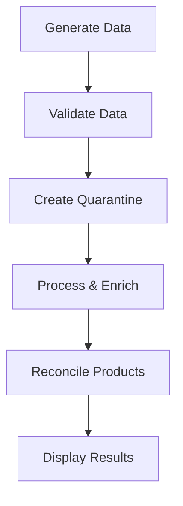

# Inventory Harmonization Pipeline

A modular Python pipeline for inventory data generation, validation, reconciliation, and processing with **config-driven file ingestion** support.

## 🚀 Quick Start

### Synthetic Data Mode (Default)
```bash
python main.py
```

### Config-Driven Ingestion Mode
```bash
python main.py --mode ingest --config configs/ingestion_config.yaml
```

### Installation

```bash
pip install -r requirements.txt
```

## 🎯 Key Features

- **Dual Mode Operation**: Synthetic data generation OR config-driven file ingestion
- **Zero-Code File Ingestion**: Add new inventory files via YAML configuration
- **Multi-Format Support**: CSV, Excel, JSON, Parquet
- **Flexible Column Mapping**: Handle any source column naming convention
- **Configurable Transformations**: Datetime, numeric, string, boolean, custom
- **Validation Rules**: Define data quality rules in configuration
- **Modular Design**: Clean separation of concerns

## 📁 Project Structure

```
hcllll/
├── configs/
│   └── ingestion_config.yaml      # Ingestion configuration
├── data/
│   ├── inventory_snapshot.csv     # Sample CSV
│   ├── restock_events.xlsx        # Sample Excel
│   └── incoming_inventory.json    # Sample JSON
├── config.py                      # Configuration constants
├── data_generator.py              # Synthetic data generation
├── validators.py                  # Data validation
├── reconciliation.py              # Product reconciliation
├── data_processor.py              # Data transformation
├── config_loader.py               # ⭐ Config file loader
├── file_reader.py                 # ⭐ Multi-format file reader
├── column_mapper.py               # ⭐ Column mapping engine
├── data_transformer.py            # ⭐ Data transformation engine
├── ingestion_engine.py            # ⭐ Ingestion orchestrator
├── generate_sample_data.py        # Sample data generator
├── main.py                        # Main script (dual-mode)
├── requirements.txt               # Dependencies
├── README.md                      # This file
└── CONFIG_DRIVEN_INGESTION.md     # Ingestion guide
```

⭐ = New config-driven ingestion modules


### 1. **config.py**
Contains all configuration constants:
- Data generation parameters (items, warehouses, days)
- Column definitions for DataFrames
- Product master data
- Validation rules and thresholds
- SKU patterns for reconciliation

### 2. **data_generator.py**
Generates synthetic inventory data:
- `generate_inventory_data()` - Creates inventory snapshots and restock events
- `generate_incoming_inventory()` - Creates incoming inventory with intentional errors
- `create_product_master()` - Generates product master reference data
- `random_timestamp()` - Utility for timestamp generation

### 3. **validators.py**
Data validation and quality checks:
- `check_negative_stock()` - Identifies negative stock levels
- `check_product_id_mismatch()` - Finds product ID inconsistencies
- `check_duplicates()` - Detects duplicate records
- `check_restock_exceeded()` - Validates restock quantities
- `create_quarantine_inventory()` - Aggregates validation failures
- `get_validation_summary()` - Generates validation statistics

### 4. **reconciliation.py**
Product ID reconciliation using fuzzy matching:
- `reconcile_product_id()` - SKU validation and fuzzy name matching
- `apply_reconciliation()` - Applies reconciliation to entire DataFrame
- `get_reconciliation_summary()` - Generates reconciliation statistics

### 5. **data_processor.py**
Data transformation and enrichment:
- `merge_snapshots_with_restocks()` - Joins snapshots with restock events
- `calculate_effective_stock()` - Computes effective stock levels
- `create_inventory_fact_table()` - Generates clean fact table
- `get_processing_summary()` - Generates processing statistics

### 6. **main.py**
Main orchestration script that executes the complete pipeline:
1. Generate synthetic data
2. Run validation checks
3. Create quarantine inventory
4. Process and enrich data
5. Run product reconciliation
6. Display results

## 🔧 Configuration

Edit `config.py` to customize:
- Number of items, warehouses, and days
- Stock quantity ranges
- Validation thresholds
- Fuzzy matching confidence threshold
- SKU patterns

## 📊 Pipeline Workflow



## 🎯 Key Features

- **Modular Design**: Each module has a single, well-defined responsibility
- **Reusability**: Functions can be imported and used independently
- **Testability**: Individual modules can be unit tested in isolation
- **Fuzzy Matching**: Uses RapidFuzz for intelligent product name matching
- **Data Quality**: Comprehensive validation rules to ensure data integrity
- **Reproducibility**: Fixed random seeds for consistent results

## 📈 Output

The pipeline generates:
- **Inventory Fact Table**: Clean inventory data excluding quarantined records
- **Enriched Snapshots**: Inventory snapshots with effective stock calculations
- **Quarantine Inventory**: Records that failed validation checks
- **Reconciled Incoming Inventory**: Incoming data with corrected product IDs
- **Summary Statistics**: Validation and reconciliation metrics

## 🛠️ Dependencies

- **pandas**: Data manipulation and analysis
- **numpy**: Numerical operations
- **rapidfuzz**: Fuzzy string matching for product reconciliation

## 📝 Example Usage

```python
from data_generator import generate_inventory_data, create_product_master
from validators import check_negative_stock
from reconciliation import apply_reconciliation

# Generate data
inventory_df, restock_df = generate_inventory_data()

# Validate
neg_stock = check_negative_stock(inventory_df)

# Reconcile
product_master = create_product_master()
incoming = generate_incoming_inventory(product_master)
reconciled = apply_reconciliation(incoming, product_master)
```

## 🎓 Benefits Over Original Script

1. **Separation of Concerns**: Clear boundaries between different functionalities
2. **Maintainability**: Easy to update individual components
3. **Scalability**: Simple to add new validation rules or data sources
4. **Readability**: Self-documenting module and function names
5. **Extensibility**: Easy to integrate with other systems or databases
